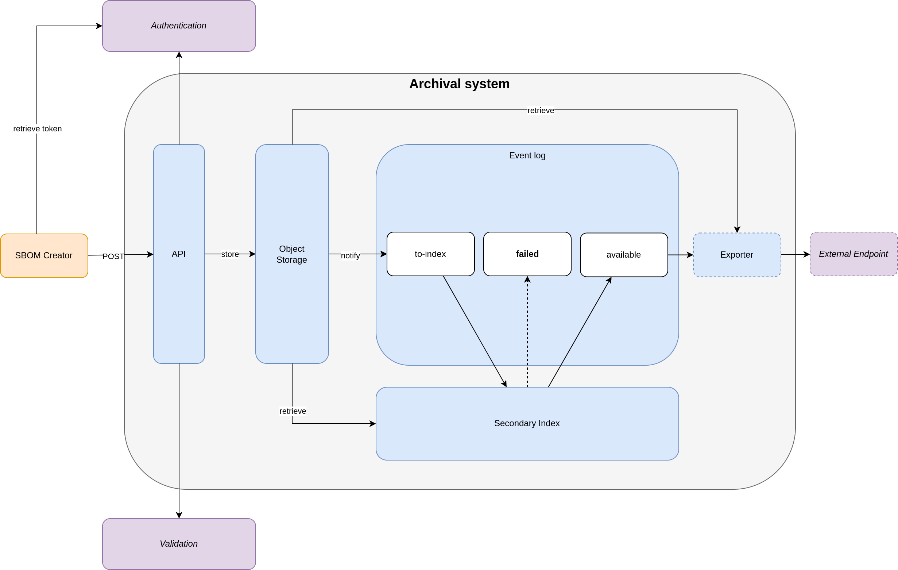
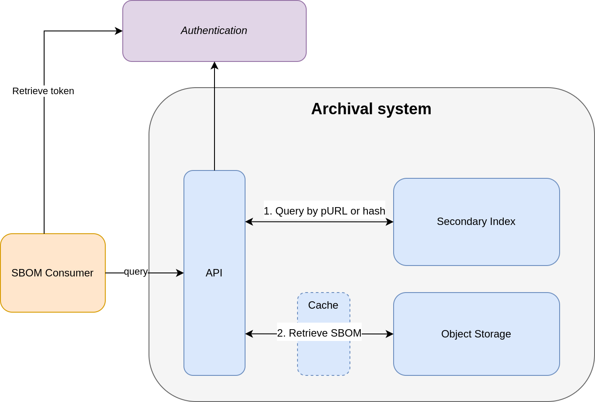

# billbo

*WIP* This is all just thoughts and ideas at this point

Billbo is a storage and archival service for Software Bill of Material (SBOM) files, from now on called SBOMs in plural instead of SBsOM.

Why would you use Billbo? If you're a big organization, you have a lot of SBOMs, possibly terrabytes of SBOM data. You have some parts of your organization that produces SBOMs, and you need to store them somewhere safe. Amazon S3 or similar is probably one of the safer options around since it's API is ubiquitous when you look for object storage.

But if you're a big organization, you may need to provide these SBOMs to consumers from time to time, either to internal users or customers, fast. And if you're fancy, maybe you even have some need to automatically stream new SBOMs to external systems.

Oh, and authentication! You definitely want that, at least for producers.

Billbo consists of:

* An API for publishing and consuming SBOM data
* Keycloak or similar (OIDC) for authentication and authorization.
* A lookup index based on SQLite. 
* Amazon S3 or similar object storage such Ceph or MinIO. This way you can run it locally with MinIO, on company infra with Ceph, or on AWS with S3.
* Apache Kafka or similar for eventing, everybody loves Kafka.

### "Why would I need all that, it's just files lol?"

You're probably not a big organization, please continue to use files.

### "I but you need 100 gazillion cores to run that system"

It's written in Rust so it must be fast. 

## Architecture
The overall design follows a (micro)-services architecture, where each component in the architecture can have clearly defined service boundaries and may be replaced independently of the other components. 

### Services

Components marked with internal are not accessible on the public internet.

* Authentication/Authorization - Service that supports OIDC for authenticating users (Keycloak) and returning a token (with claims for authorization).

* API - entry point for SBOM producers and consumers. Users are authenticated by the API using a token provided by the authentication service. This service can be scaled dynamically by traffic demand.

* Validation - Service that can validate an SBOM according to company policies (Open Policy Agent or Seedwing).

* (Internal) Object Storage - Storage of SBOMs. The most important property here is that it is durable and has a way to do disaster recovery.

* (Internal) Object Cache - A fixed size cache improving retrieval performance.

* (Internal) Event log - Capturing changes to the object storage. The log has topics containing references to SBOM that need to be indexed and references to SBOM files that are fully stored and indexed. The stream of updates can be consumed by an exporter that publishes SBOM files to an external system.

* (Internal) Secondary Index - Index for quick lookups based on package URL (pURL) or artifact hash (sha256). The index need not be durable as it can be recreated from the data, and can be kept small. The index involves a consumer from the event log that can retrieve the object-to-be-indexed from the storage.

* (Internal) Exporter - An optional service that gets notified when an SBOM is created or is changed, and can retrieve it and publish it to an external system.

As objects are inserted into the storage, an event is emitted into the event log. The advantage of this design is that we can ensure consistency of the object storage, which we consider the most important, and keep data transfers to a minimum. In contrast, an event-sourced system would require us to write the entire SBOM into multiple systems multiple times.

#### Produce flow

#### Consume flow

## Crates 

Billbo consists of the following Rust crates, of which some are common APIs and others are standalone micro-services.

* `billbo-storage` - facade to s3 api used by indexer and api
* `billbo-api` - API server
* `billbo-indexer` - Indexing process consuming events from event-bus and indexing into sqlite
* `billbo-index` - API for accessing index
* `billbo-exporter` - Exporter process consuming events from event-bus and exporting data
* `billbo-event-bus` - API for consuming from event bus (and publishing)

